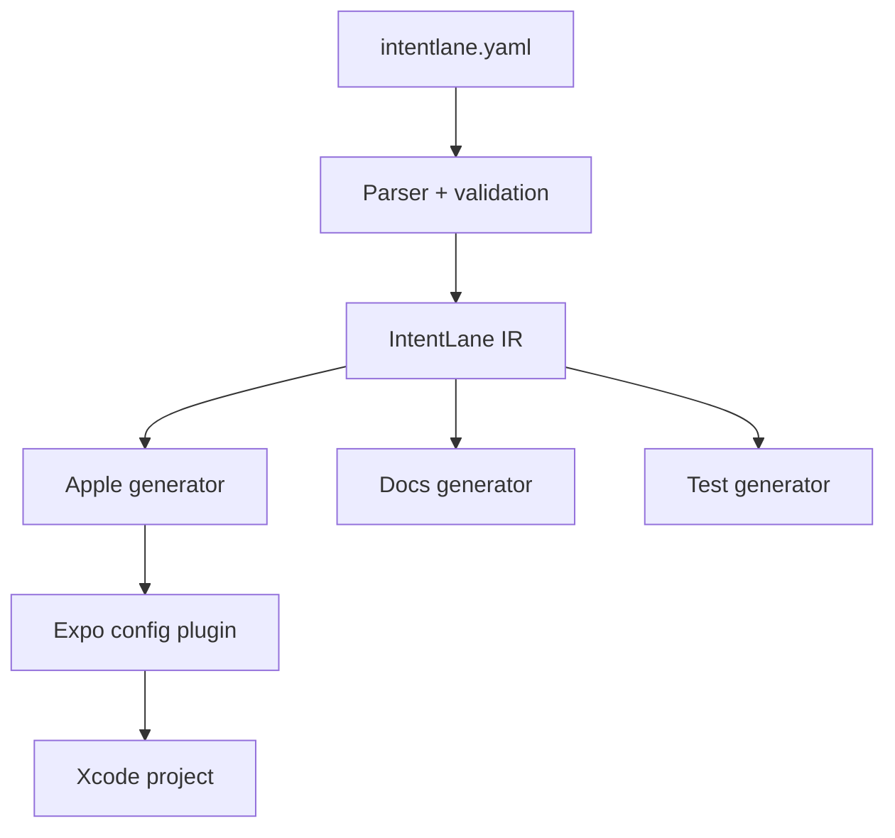

# IntentLane — architecture technique

## Principe

Le YAML est la source de vérité. Le compilateur transforme un AST normalisé en plusieurs cibles. Aucun LLM n'est nécessaire pour compiler.



## Monorepo

```text
intentlane/
├── apps/
│   ├── example-expo/
│   └── example-macos/
├── packages/
│   ├── schema/              # types, JSON Schema, migrations
│   ├── core/                # parser, IR, validation, diagnostics
│   ├── generator-apple/     # templates Swift
│   ├── expo-plugin/         # config plugin
│   ├── runtime-expo/        # API JS optionnelle
│   ├── cli/                 # init/validate/generate/doctor/test
│   └── testkit/             # fixtures, snapshots, assertions
├── fixtures/
├── docs/
├── pnpm-workspace.yaml
├── turbo.json
└── package.json
```

## Stack

- Node 22+, TypeScript strict.
- pnpm workspaces + Turborepo.
- Zod pour validation runtime ; JSON Schema exporté pour IDE.
- Commander ou Clipanion pour le CLI.
- Vitest pour core/générateurs.
- Swift Testing/XCTest pour les fixtures Apple.
- Expo Config Plugins pour mutation déterministe du projet natif.
- Mustache/Handlebars interdit dans le core si cela fragilise l'échappement ; préférer un petit emitter Swift typé.

## Intermediate Representation

```ts
type IntentIR = {
  schemaVersion: string
  app: AppIR
  intents: NormalizedIntent[]
  entities: NormalizedEntity[]
  locales: string[]
  capabilities: CapabilitySet
}
```

L'IR contient des valeurs normalisées, jamais du YAML brut. Toutes les validations s'effectuent avant génération.

## Packages

### `@intentlane/schema`

Types publics, schéma JSON, changelog de schéma et migrations automatiques.

### `@intentlane/core`

Lecture, validation sémantique, capability resolution, diagnostics avec code stable (`IL1001`, etc.) et construction IR.

### `@intentlane/generator-apple`

Émet :

- un type Swift par intention ;
- entités et queries ;
- `AppShortcutsProvider` ;
- ressources localisées ;
- registre de handlers ;
- snippets simples ;
- manifeste de génération.

### `@intentlane/expo`

Plugin idempotent qui copie les sources générées, configure les entitlements nécessaires et ajoute les ressources. Il ne doit pas modifier arbitrairement le projet de l'utilisateur.

### `@intentlane/runtime-expo`

API minimale pour enregistrer les routes et synchroniser les données utiles. Ne pas prétendre que JavaScript peut toujours s'exécuter en arrière-plan.

## Stratégies d'exécution

| Mode | Usage | MVP | Limite |
|---|---|---:|---|
| `open_app` | navigation/deep link | Oui | ouvre l'app |
| `native` | action locale Swift | Oui | handler natif requis |
| `http` | backend distant | Expérimental | auth et réseau |
| `javascript` | handler JS direct | Non | cycle de vie incertain |

## Compatibilité

Chaque fonction générée possède une disponibilité minimale. Les fonctions récentes telles que `RelevantEntities`, `EntityCollection`, `SyncableEntity`, paramètres union et long-running intents restent des capabilities optionnelles. Le générateur doit refuser une capability incompatible avec la cible déclarée.

## Sécurité

- Deny-by-default pour opérations destructives.
- Confirmation obligatoire pour suppression, paiement, publication ou partage.
- Authentification obligatoire configurable pour données privées.
- URLs et paramètres encodés, jamais interpolés.
- Allowlist d'hôtes pour `http`.
- Tokens récupérés au runtime via Keychain/app host ; jamais dans YAML.
- Logs expurgés des valeurs sensibles.
- Pas de télémétrie par défaut dans le CLI OSS.

## Tests

1. Parser : fixtures valides/invalides.
2. Validation : diagnostics stables.
3. Generator : golden snapshots Swift.
4. Plugin : idempotence après deux prebuilds.
5. Swift : compilation de la fixture sous plusieurs Xcode supportés.
6. E2E manuel MVP : Shortcuts et Siri sur simulateur/appareil.

## Décisions structurantes

- ADR-001 : YAML contract-first.
- ADR-002 : compilation déterministe sans LLM.
- ADR-003 : Expo premier adaptateur.
- ADR-004 : pas de handler JS garanti en background.
- ADR-005 : code généré clairement isolé et remplaçable.
- ADR-006 : la sortie est neutre vis-à-vis de la plateforme. Le Swift généré compile pour iOS comme pour macOS et le toolchain en extrait les mêmes métadonnées App Intents ; `apps/example-macos` le prouve sans projet Xcode, en compilant avec `swiftc` puis en invoquant `appintentsmetadataprocessor`. Expo reste le premier adaptateur d'intégration (ADR-003) parce qu'une app Expo régénère son dossier natif à chaque prebuild, mais ce n'est pas une contrainte du générateur : un target Swift natif commite simplement le fichier généré.

