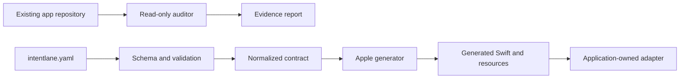

# IntentLane architecture

## Principle

The versioned YAML contract is the source for generation. The auditor reads an
existing repository without changing it. Both paths are deterministic and run
without a model.



The application owns data lookup, authorization, navigation, and side effects.
Generated interfaces stop at that boundary.

## Repository map

```text
intentlane/
├── apps/
│   ├── example-expo/       # workspace integration fixture
│   ├── example-macos/      # Swift and metadata extraction fixture
│   └── studio/             # unreleased macOS operator application
├── packages/
│   ├── schema/             # contract types and validation
│   ├── core/               # audit, evidence, diagnostics, and normalized data
│   ├── generator-apple/    # deterministic Swift emitter
│   ├── expo-plugin/        # unpublished Expo config plugin
│   ├── cli/                # intentlane command
│   └── studio-protocol/    # Studio capability-map protocol
├── pilots/                 # public-app contracts and automated evidence
├── docs/                   # maintained documentation
├── openspec/               # accepted requirements and work in flight
├── intentlane.schema.json  # machine-readable contract
└── intentlane.yaml         # executable reference contract
```

## Stack

- Node.js 22 or newer and strict TypeScript.
- pnpm workspaces and Turborepo.
- Zod for runtime validation and JSON Schema for editor support.
- Commander for the CLI.
- Vitest for TypeScript tests.
- Swift Testing and XCTest for Studio and Apple fixtures.
- Expo Config Plugins for the workspace-only bridged example.

## Packages

### `packages/schema`

Owns the public YAML shape, schema-level validation, pilot manifests, evidence
ledgers, and claim-confidence inputs.

### `packages/core`

Owns normalized data, stable diagnostics, repository discovery, capability
detection, audit reports, evidence validation, report comparison, release gates,
and client deliverable data.

The auditor fingerprints the inspected worktree before and after a run. It does
not generate into the target.

### `packages/generator-apple`

Emits App Intents Swift, localized strings, generated-file manifests, resolver
and handler interfaces, schema conformances supported by the current catalogue,
and an optional adapter template that is written once.

The generator supports `open_app` and bounded native handlers. HTTP execution is
rejected. Endpoint queries and generated enum schema conformances are not part of
the current contract.

### `packages/expo-plugin`

Contains the config plugin exercised by `apps/example-expo`. It generates into
the native project during prebuild and registers the Swift and localization
resources idempotently.

The package is not published. It is a contributor fixture until a release is cut
under a scope the maintainer controls.

### `packages/cli`

Provides contract commands, the read-only audit, evidence validation, report
comparison, verification, pilot execution, and source-visible commands that may
be ahead of the last npm release. The root README names the boundary between the
published package and `main`.

### `packages/studio-protocol`

Provides the typed capability-map data used by the unreleased Studio app. Studio
runs the same engine as the CLI and does not maintain a second interpretation of
audit states.

## Evidence model

IntentLane preserves four separate layers:

1. Source evidence says a declaration or implementation exists.
2. Build evidence says the Apple toolchain accepted it.
3. Application tests say the app-owned boundary behaves as contracted.
4. Human evidence says a named system journey was observed under recorded conditions.

No layer silently promotes itself into the next one.

## Safety boundaries

- Destructive operations require an explicit policy.
- Contracts contain no static credentials.
- Generated URLs and parameters are encoded.
- The auditor is local and read-only.
- Indexed data is classified before a readiness claim is made.
- Generated code never invents application permissions or ownership rules.
- No telemetry is enabled by default in the open-source CLI.

## Verification

The CI workflow runs the authoritative checks. It typechecks the TypeScript,
runs the automated suite, proves deterministic generation, compiles generated
Swift, extracts macOS App Intents metadata, and builds the Expo example for an
iOS simulator.

Manual Siri, Spotlight, or Shortcuts observation remains a separate pilot step.
